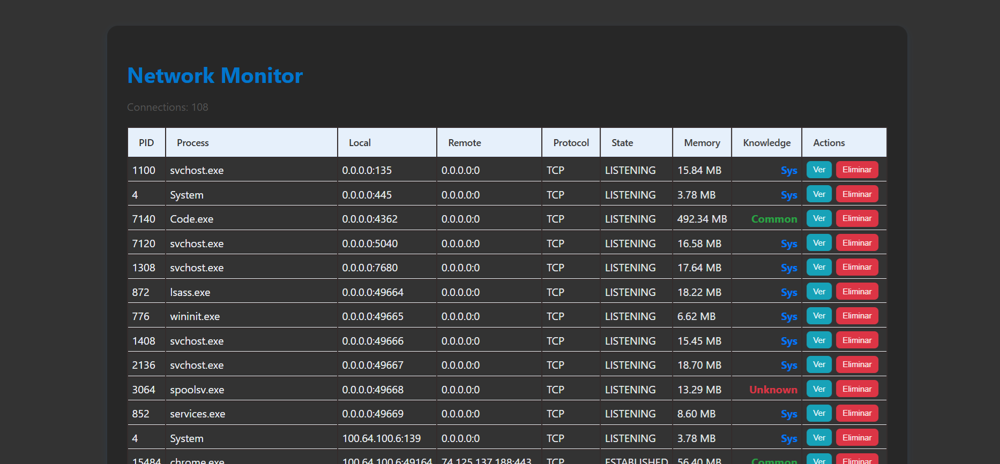

# 🔍 Network Process Monitor

## 📸 Vista previa | Preview

Una aplicación web moderna construida con **Flask (backend)** y **React (frontend)** que permite:

- 📡 Listar procesos activos del sistema (vía `netstat`)
- 🔍 Ver detalles de cada proceso
- ❌ Eliminar procesos desde la interfaz web

---

A modern web application built with **Flask (backend)** and **React (frontend)** that allows you to:

- 📡 View active network processes using `netstat`
- 🔍 See detailed information about each process
- ❌ Terminate processes directly from the interface

---

## 🛠 Tecnologías | Technologies Used

- 🐍 **Flask** – API REST para exponer información del sistema
- ⚛️ **React** – Interfaz de usuario interactiva y responsiva
- 📦 **psutil** + `netstat` – Para obtener información del sistema
- 🌐 **Fetch API** – Para comunicación entre el frontend y backend

---

- 🐍 **Flask** – RESTful API backend
- ⚛️ **React** – Interactive frontend UI
- 📦 **psutil** + `netstat` – For fetching system-level network and process info
- 🌐 **Fetch API** – For communication between frontend and backend

---

## 📁 Estructura del proyecto | Project Structure

/backend
└── app.py # Flask app con 3 endpoints
/frontend
└── src/
└── App.jsx # UI con tabla, filtros y acciones

---
